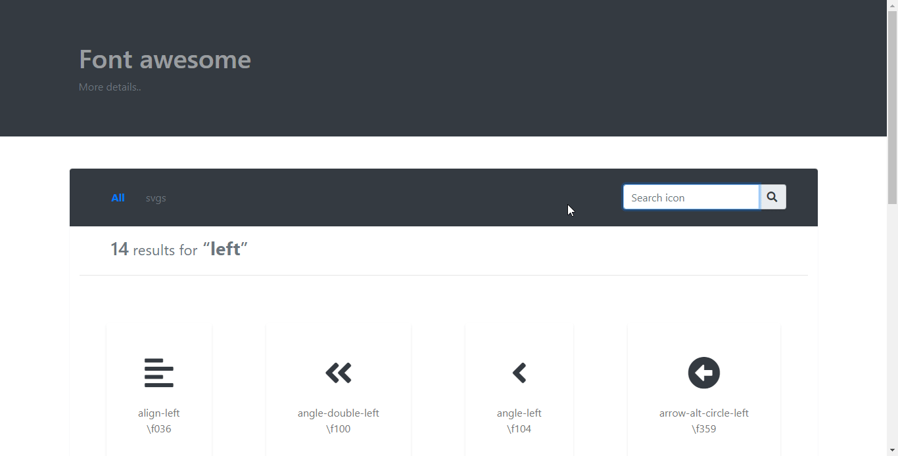

# fontawesome
An app where you can surf fontawesome icons offline 🤗

### How to use
Just download like any other django app. if you want, you can create an
environment and install django, or install it globally.

run `python manage.py runserver`

open the browser at the url, most probably http://127.0.0.1:8000
